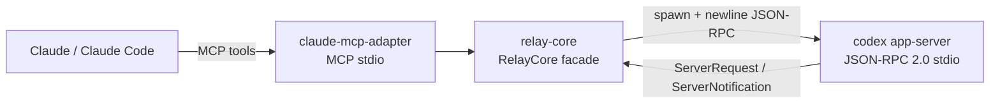

# Codex Relay Bridge — Architecture (Phase 1)

## Overview

Codex Relay Bridge is a local MCP server that lets Claude / Claude Code drive **Codex App Server** over a single managed stdio JSON-RPC child process.



## Transport iron rules (MVP)

- Spawn: `spawn(CODEX_BIN, ["app-server"], { stdio: ["pipe","pipe","pipe"] })`
- Default listen is stdio (no args). **No** `daemon` / `proxy`, no public WebSocket, no AppleScript / System Events.
- All bridge logs → **stderr** (or files). **stdout** is reserved for the MCP channel.

## Component map

| Module | Role |
|---|---|
| `app-server-client.ts` | Child spawn, newline framing, id correlation, handshake, strict envelope reject |
| `thread-registry.ts` | In-memory task/thread index + project allowlist (realpath) |
| `turn-state.ts` | Per-thread promise-chain lock + idle/active routing |
| `idempotency.ts` | 24h TTL map for `codex_start_task` |
| `event-store.ts` | Append-only normalized events + cursor reads |
| `approvals.ts` | Fail-closed ServerRequest handling (queue + timeout + flush) |
| `index.ts` | `RelayCore` facade: 5 tool methods |
| `mcp-adapter/*` | MCP tool schemas + stdio server |

## MCP tools

1. `codex_start_task` — allowlist → `thread/start` → locked `turn/start`
2. `codex_continue_task` — optional `thread/resume` → locked `turn/start` or `turn/steer` (with required `expectedTurnId`)
3. `codex_get_status` — pure read
4. `codex_read_output` — pure read with cursor
5. `codex_respond_approval` — human allow/deny mapped per ServerRequest kind

## Approval fail-closed

Any ServerRequest that is unknown, times out (default 120s), or is pending when the bridge/app-server dies is resolved with **deny semantics**. There is **no default-allow**. SIGTERM/SIGINT flushes all pending approvals as deny before exit (best-effort).

## Phase 1 non-goals

SQLite persistence, HTTP/SSE, multi app-server pool, auto-restart, Keychain tokens, mac-host-agent UI, allow-with-amendment.

## Protocol source of truth

`src/generated/` is produced by:

```bash
codex app-server generate-ts --out src/generated
```

Method names, decision literals, and param shapes must match generated types. See `spike-report.md` for plan-vs-generated discrepancies.
